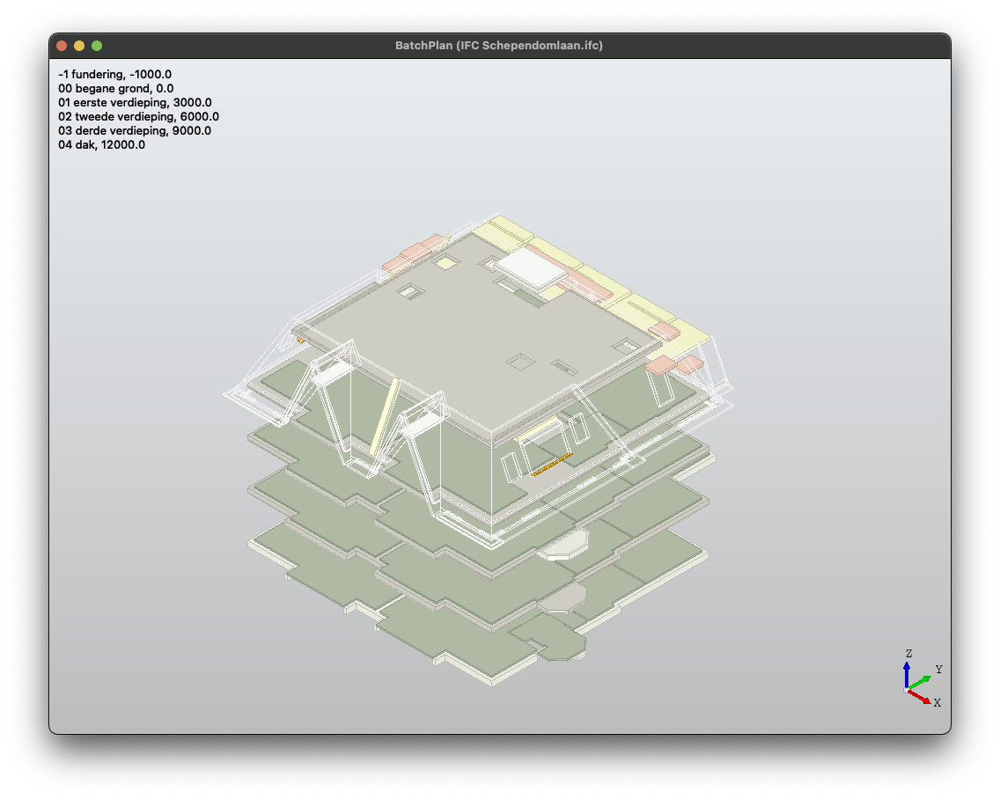

# BatchPlan

## About

BatchPlan as a robust large-scale floor plan extraction tool designed to be highly customizable, extensible, and pluggable in various capacities. The design decisions are meticulously crafted, particularly for the processing of extensive BIM data stored in IFC files.

## Installation

BatchPlan is dependent to [pythonocc-core](https://github.com/tpaviot/pythonocc-core) which is curretly only available as conda package. Thus we need to create a conda environment as follows:

First we need to copy [environment.yml](./environment.yml) to your machine and run the following command to create the environment with needed dependencies:

```
conda env create -f environment.yml
```

Now we need to install BatchPlan. There is two ways:

1. Building from source (recommended):

```
git clone https://github.com/byildiz/BatchPlan.git
cd BatchPlan
pip install .
```

2. Installing with pip:

```
pip install BatchPlan
```

## Usage

### Extract Floor Plan

`extract_floor_plans` module is used to extract floor plans.

```
% python -m batchplan.extract_floor_plans --help
usage: extract_floor_plans.py [-h] [--output OUTPUT] [--use-storey] [--load-plugin] [--formatter FORMATTER] [--filter-fn FILTER_FN] [--filter FILTER] [--color-fn COLOR_FN] [--skip-colorless]
                              [--width WIDTH] [--height HEIGHT]
                              ifc_paths

positional arguments:
  ifc_paths

options:
  -h, --help            show this help message and exit
  --output OUTPUT       output directory
  --use-storey          use IfcBuildingStorey elements to infer floors
  --load-plugin         load plugin module (plugin.py)
  --formatter FORMATTER
                        selected formatters
  --filter-fn FILTER_FN
                        filter function for filter out elements
  --filter FILTER       filter string to filter aout elements using IfcOpenShell's builtin filtering feature
  --color-fn COLOR_FN   color function to determine elements' colors in floor plan
  --skip-colorless      skip elements if the color function doesn't return a color for an element
  --width WIDTH         floor plan width
  --height HEIGHT       floor plan height
```

#### Extract floor plans in PNG format

```
python -m batchplan.extract_floor_plans examples/data/Shependomlaan/IFC\ Schependomlaan.ifc --output output
```

After the above command successfully runs, an output directory will be created with the following structure and content:

```
output
└── IFC Schependomlaan
    ├── -1 fundering_3D.png
    ├── -1 fundering_floor_plan.png
    ├── 00 begane grond_3D.png
    ├── 00 begane grond_floor_plan.png
    ├── 01 eerste verdieping_3D.png
    ├── 01 eerste verdieping_floor_plan.png
    ├── 02 tweede verdieping_3D.png
    ├── 02 tweede verdieping_floor_plan.png
    ├── 03 derde verdieping_3D.png
    ├── 03 derde verdieping_floor_plan.png
    └── 3D.png
```

#### Extract floor plans in WTK format

```
python -m batchplan.extract_floor_plans examples/data/Shependomlaan/IFC\ Schependomlaan.ifc --formatter FloorWKTFormatter --output output
```

After the above command successfully runs, an output directory will be created with the following structure and content:

```
output
└── IFC Schependomlaan
    ├── -1 fundering.csv
    ├── 00 begane grond.csv
    ├── 01 eerste verdieping.csv
    ├── 02 tweede verdieping.csv
    ├── 03 derde verdieping.csv
    └── 3D.png
```

### Mark Floors

`mark_loors` module is used to mark floors and save them in csv file.

```
% python -m batchplan.mark_floors --help
usage: mark_floors.py [-h] [--use-storeys] root

positional arguments:
  root

options:
  -h, --help     show this help message and exit
  --use-storeys  pre-fill floors using IfcBuildingStorey elements
```

Example usage:

```
python -m batchplan.mark_floors --use-storeys examples/data/Shependomlaan
```

If you run the above command, you will see a GUI like the one below:



## Known Issues and Limitations

- There is memory leakage which makes processing huge projects hard.
- BatchPlan currently can't run on a machine without a GUI environment.
